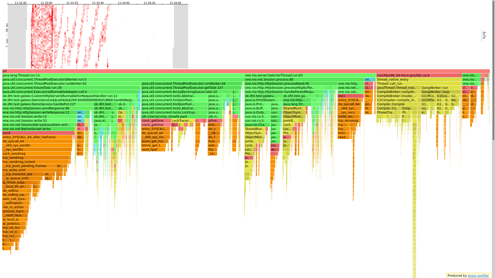
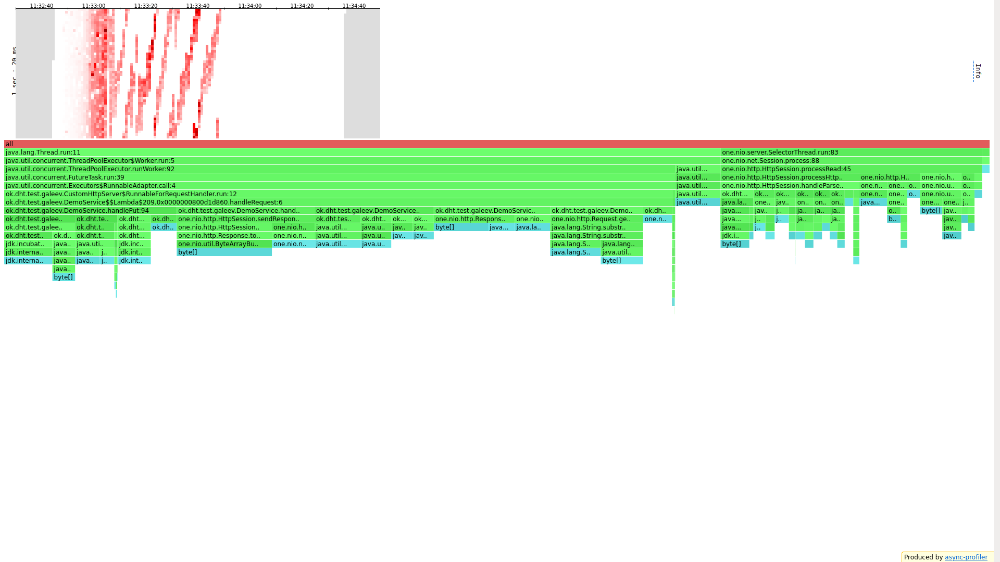
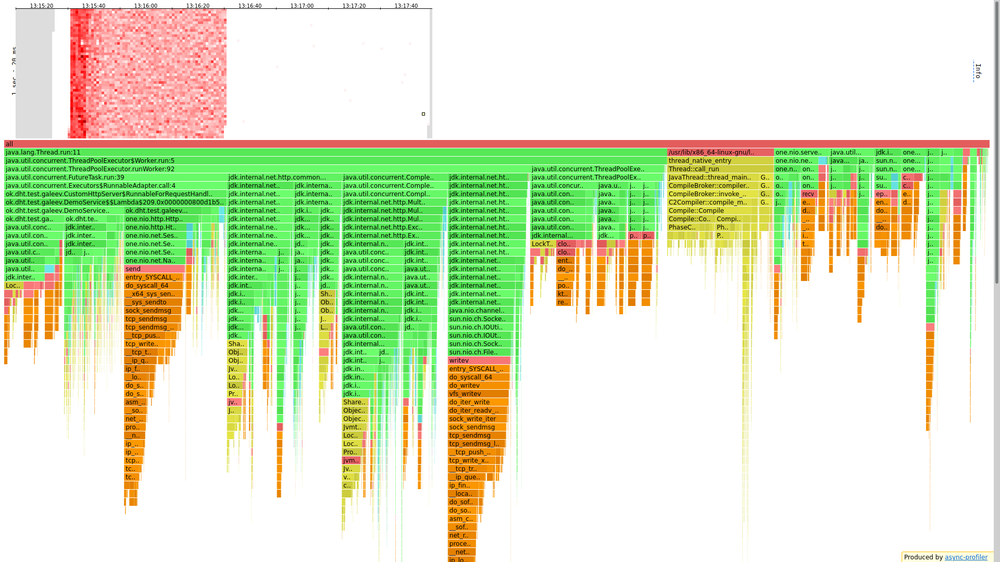
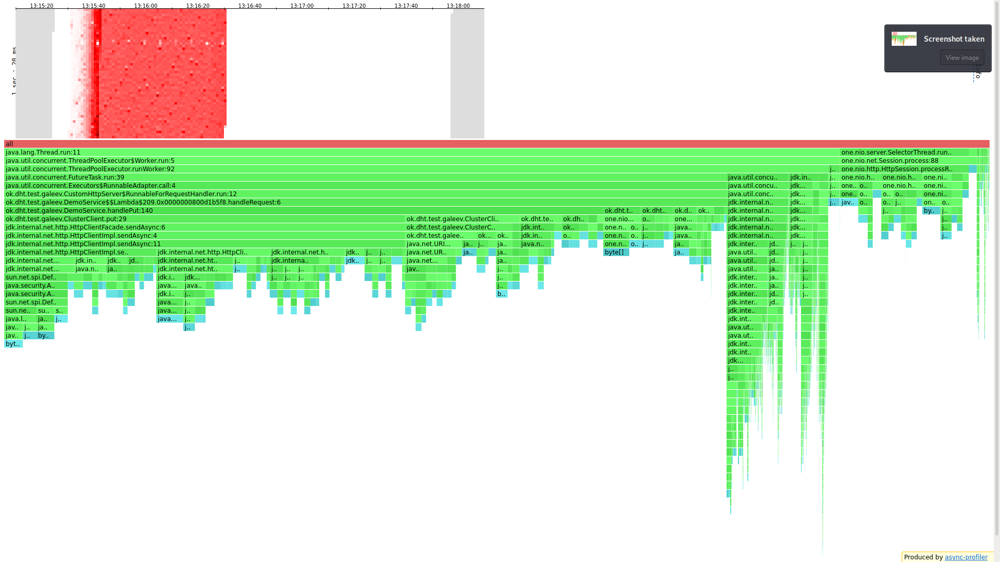
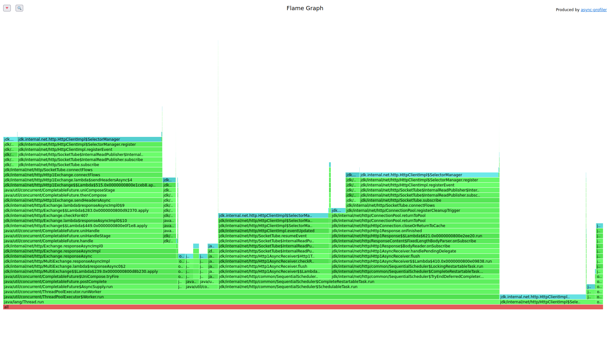
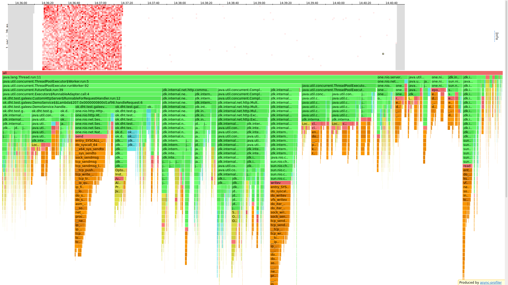
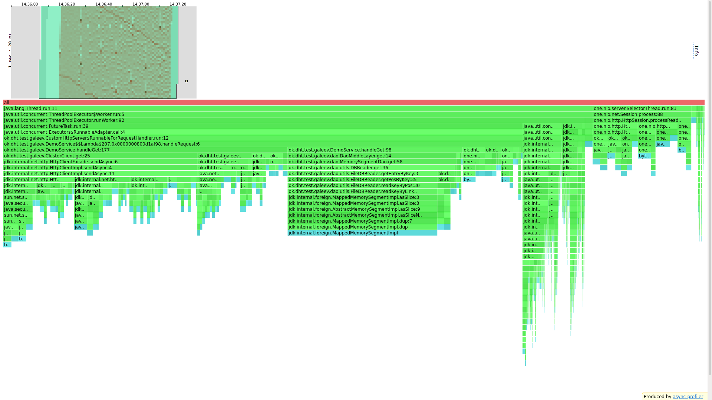
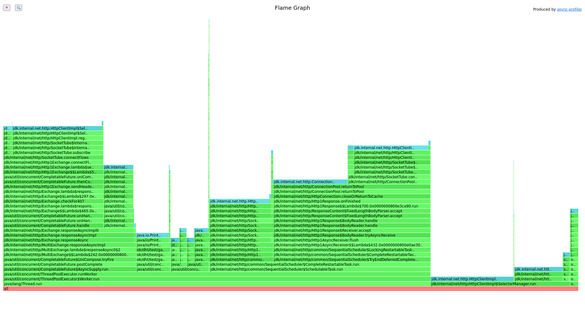

# Stage 3

### Предположения
Было реализовано консистентное хеширование, что теоретически, при большом объеме 
данных(когда будет много запросов к диску) должно ускорить работу, так как искать 
сразу на 10 дисках быстрее, чем на 1, но тут появляется вопрос с сетью, это ведь
тоже дополнительные затраты.

## Сравнение с прошлым этапом
1 нода, те же параметры для wrk
#### Было
```
└─$ wrk -t 1 -c 64 -d 60s -s /media/coradead/Windows1/Users/CORADEAD/IdeaProjects/2022-highload-dht/src/main/java/ok/dht/test/galeev/reports/scritps/put.lua -L http://localhost:19234 -R 40000
Running 1m test @ http://localhost:19234
  1 threads and 64 connections
  Thread calibration: mean lat.: 5.759ms, rate sampling interval: 35ms
  Thread Stats   Avg      Stdev     Max   +/- Stdev
    Latency     2.27ms    2.45ms  60.48ms   92.72%
    Req/Sec    40.59k     1.47k   48.24k    82.37%
  Latency Distribution (HdrHistogram - Recorded Latency)
 50.000%    1.68ms
 75.000%    2.40ms
 90.000%    3.80ms
 99.000%   12.48ms
 99.900%   28.88ms
 99.990%   46.85ms
 99.999%   58.81ms
100.000%   60.51ms
----------------------------------------------------------
  2393641 requests in 1.00m, 152.94MB read
Requests/sec:  39893.74
Transfer/sec:      2.55MB
```

#### Стало
```
└─$ wrk -t 1 -c 64 -d 60s -s /media/coradead/Windows1/Users/CORADEAD/IdeaProjects/2022-highload-dht/src/main/java/ok/dht/test/galeev/reports/scritps/put.lua -L http://localhost:19234 -R 40000
Running 1m test @ http://localhost:19234
  1 threads and 64 connections
  Thread calibration: mean lat.: 1028.461ms, rate sampling interval: 3143ms
  Thread Stats   Avg      Stdev     Max   +/- Stdev
    Latency    11.36s    10.33s   35.42s    78.60%
    Req/Sec    13.83k     8.52k   32.70k    80.00%
  Latency Distribution (HdrHistogram - Recorded Latency)
 50.000%    5.40s 
 75.000%   19.69s 
 90.000%   28.66s 
 99.000%   33.69s 
 99.900%   34.50s 
 99.990%   34.96s 
 99.999%   35.16s 
100.000%   35.45s 
----------------------------------------------------------
  978878 requests in 1.00m, 62.55MB read
Requests/sec:  16314.87
Transfer/sec:      1.04MB
```
Ну такое. Заметное ухудшение.
Что на графах?

### PUT:
#### CPU:

В первую очередь заметно то, что я изменил обработку реквестов (раньше она работала
очень костыльльно, делалось это, чтобы максимально сохранить функционал one nio,
но после 2 стейджа было решено изменить это). Теперь работники занимают 28% вместо 48%
(конечно надо учитывать, что и общий объем работы изменился). Нагрузка стала менее 
равномерной, но это, скорее всего, из-за неправильного рейта.

#### ALLOC:

В плане выделения памяти ничего не изменилось.

Снизив нагрузку до 20к уже можно получить приемлемый результат:
```└─$ wrk -t 1 -c 64 -d 60s -s /media/coradead/Windows1/Users/CORADEAD/IdeaProjects/2022-highload-dht/src/main/java/ok/dht/test/galeev/reports/scritps/put.lua -L http://localhost:19234 -R 20000
Running 1m test @ http://localhost:19234
  1 threads and 64 connections
  Thread calibration: mean lat.: 17.603ms, rate sampling interval: 93ms
  Thread Stats   Avg      Stdev     Max   +/- Stdev
    Latency     2.07ms    1.03ms  27.97ms   70.45%
    Req/Sec    20.11k   264.98    21.22k    70.36%
  Latency Distribution (HdrHistogram - Recorded Latency)
 50.000%    1.98ms
 75.000%    2.64ms
 90.000%    3.33ms
 99.000%    4.99ms
 99.900%    8.16ms
 99.990%   14.99ms
 99.999%   23.22ms
100.000%   27.98ms
```

## Распределим все на 3 ноды
### PUT
```
└─$ wrk -t 1 -c 64 -d 60s -s /media/coradead/Windows1/Users/CORADEAD/IdeaProjects/2022-highload-dht/src/main/java/ok/dht/test/galeev/reports/scritps/put.lua -L http://localhost:19234 -R 20000
Running 1m test @ http://localhost:19234
  1 threads and 64 connections
  Thread calibration: mean lat.: 1591.149ms, rate sampling interval: 4202ms
  Thread Stats   Avg      Stdev     Max   +/- Stdev
    Latency    14.10ms   76.37ms   1.06s    97.10%
    Req/Sec    20.30k     0.92k   23.19k    90.91%
  Latency Distribution (HdrHistogram - Recorded Latency)
 50.000%    1.99ms
 75.000%    2.59ms
 90.000%    3.36ms
 99.000%  488.45ms
 99.900%  794.62ms
 99.990%  955.90ms
 99.999%    1.05s 
100.000%    1.06s 
----------------------------------------------------------
  1196814 requests in 1.00m, 76.47MB read
  Non-2xx or 3xx responses: 9
Requests/sec:  19946.74
Transfer/sec:      1.27MB
```

Посмотрим на флейм граф

#### CPU:

В начале видно, как поработал jit. Очень равномерное распределение, пустых мест
почти не осталось. На этот раз работники заняли 67%, причем хендлер всего 22%, а
все остальное время ушло на работу тред пула с запросами в бд(тредпул отправляет
запрос, в то время как тред, создавший запрос ждет с ограничением по времени) и 
InternalWriteSubscriber, который занимается проверкой безопасности и записью в
сокет, еще 11.6 процентов занимает SequentialScheduler, который улучшает
синхронизацию меж сокетами. Если посмотреть на хендлер, то всего 1% от общего
времени занимаю запросы в локальную DAO, 1.7% на работу роутера, 7.88 на отправку
ответов и 12 на запросы в другие ноды.

#### ALLOC:

Большая часть(60%) аллокаций происходит для создания запросов в соседние ноды,
еще 4% на отправку ответов, еще 3.2 на работу роутера запросов. Так же здесь видны 
следы SequentialScheduler(3%) и фьчеров(6%). HTTP накладывает большой оверхед и
смена на что-то более эффективное по памяти - может улучшить ситуацию.

#### LOCK

Посмотрев на локи сразу бросается в глаза, что почти все время занимает selector manager,
синхронизирующий все внутри http клиента.
    
#### Дополнительно 3х минутный put
```
└─$ wrk -t 1 -c 64 -d 300s -s /media/coradead/Windows1/Users/CORADEAD/IdeaProjects/2022-highload-dht/src/main/java/ok/dht/test/galeev/reports/scritps/put.lua -L http://localhost:19234 -R 20000
Running 5m test @ http://localhost:19234
  1 threads and 64 connections
  Thread calibration: mean lat.: 496.585ms, rate sampling interval: 2234ms
  Thread Stats   Avg      Stdev     Max   +/- Stdev
    Latency     1.99ms    0.94ms  25.07ms   73.00%
    Req/Sec    20.01k    11.17    20.05k    73.64%
  Latency Distribution (HdrHistogram - Recorded Latency)
 50.000%    1.91ms
 75.000%    2.46ms
 90.000%    3.08ms
 99.000%    4.84ms
 99.900%    7.95ms
 99.990%   14.07ms
 99.999%   19.39ms
100.000%   25.09ms
----------------------------------------------------------
5996810 requests in 5.00m, 383.17MB read
Requests/sec:  19989.34
Transfer/sec:      1.28MB
```
Хочется подметить очень хорошую среднюю задержку в 2 мс И максимальную всего в 25.
А так же распределение данных на 3 ноды: 80Мб, 80Мб и 80Мб, что отлично показывает, что мурмур хеш рулит.

### GET
```
└─$ wrk -t 1 -c 64 -d 60s -s /media/coradead/Windows1/Users/CORADEAD/IdeaProjects/2022-highload-dht/src/main/java/ok/dht/test/galeev/reports/scritps/get.lua -L http://localhost:19234 -R 70
00 
Running 1m test @ http://localhost:19234
  1 threads and 64 connections
  Thread calibration: mean lat.: 4.221ms, rate sampling interval: 22ms
  Thread Stats   Avg      Stdev     Max   +/- Stdev
    Latency     5.09ms    6.80ms 113.15ms   89.11%
    Req/Sec     7.18k     2.00k   29.64k    67.89%
  Latency Distribution (HdrHistogram - Recorded Latency)
 50.000%    2.42ms
 75.000%    6.11ms
 90.000%   12.38ms
 99.000%   34.01ms
 99.900%   69.95ms
 99.990%   93.89ms
 99.999%  110.21ms
100.000%  113.21ms
----------------------------------------------------------
  418904 requests in 1.00m, 27.86MB read
Requests/sec:   6981.73
Transfer/sec:    475.46KB
```

#### CPU:

В целом, если говорить об изменениях, ситуации схожа с put. Наверное самое главное
отличие, в том, что меньше времени тратится на поиск, и больше на запросы к другим нодам.
Если на put хит мапа была хорошо закрашена, то здесь нельзя сказать подобного, мы видим 
очень много белый квадратиков, что свидетельствует о том, что результат можно улучшить.

#### ALLOC:

Тут работники потребляют 85%, остальные уходят на нужды сервера. 25% уходят на внутренние
запросы, 1% на работу работников с очередью, а все остальное - на запросы к другим нодам.

#### LOCK:

40% занимает SchedulableTask, занимающийся регистрацией ивентов, 6.6 занимает взятие из
очереди и еще 23% - это локи CompletableFuture, а так же 25% - Selector manager.

## Выводы
Очень снизилась производительность, из-за необходимости взаимодействовать с другими 
нодами по сети по chfdytyb. с прошлым стейджом, но теоретически, если запускать на 
разных компьютерах, то можно получить прирост производительности, ведь поиск будет
происходить на нескольких дисках сразу. Так же смена протокола с http на что-то более
эффективное тоже улучшит результат. И мы достигли своей главной цели - распределение
данных. Теперь мы можем хранить данные сразу в нескольких частях мира.