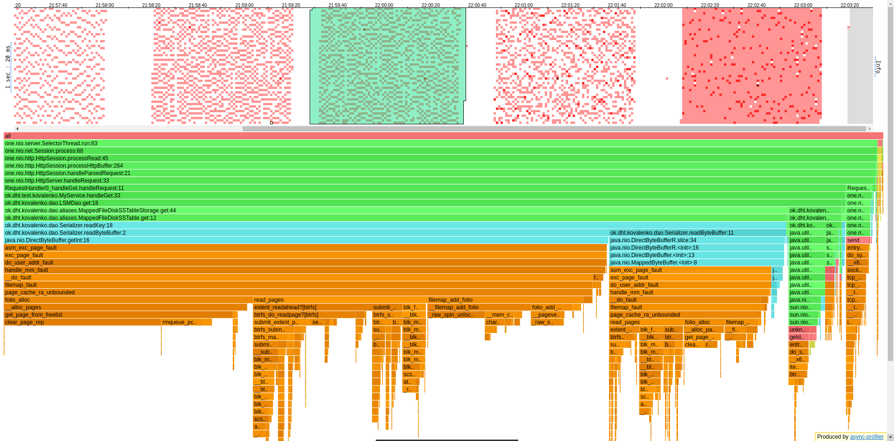

# Отчёт по профилированию NoSQL-базы данных

## Общая часть
На табличках по 1МБ система показывала себя не лучшим образом
(скорость чтения дисковой головки была одинаковой, но пробег по тысяче файлов занимал львиную долю времени),
так что было решено увеличить размер хранимых и записываемых таблиц до 64МБ, сохраняя
имитацию высокой нагрузки. Дополнительно в качестве оптимизации был добавлен алгоритм key-range,
позволяющий по чтению первого и последнего ключа в файле (а они отсортированы) определять,
стоит ли вообще смотреть в данных файл или можно его пропустить, не заставляя бинарный поиск
выполнять десятки сисколов. Это значительным образом повысило производительность, но слабые места
всё равно остались. Профилирование проводилось на данных размером 3ГБ, что явно
не вмещается в КЭШ современных компьютеров, а значит сие исследование представляет определённый
интерес с точки зрения анализа перформанса БД.

## GET
Ввиду того, что бить по одному и тому же ключу непоказательно с точки зрения анализа
перформанса БД (процессор закэширует нужную страницу и будет обращаться к ней, а не искать
каждый раз её по-новой), было решено выставлять ключи рандомно.

### Бьём по существующим ключам
Разогрев на рейте 1к:
```
../wrk2/wrk -c 1 -d 60s -t 1 -R 1000 -L http://localhost:19234/v0/entity -s get.lua
Running 1m test @ http://localhost:19234/v0/entity
  1 threads and 1 connections
  Thread calibration: mean lat.: 5568.258ms, rate sampling interval: 17498ms
  Thread Stats   Avg      Stdev     Max   +/- Stdev
    Latency    32.44s    12.53s    0.89m    58.44%
    Req/Sec   120.00     10.00   130.00    100.00%
6813 requests in 1.00m, 491.79KB read
  Non-2xx or 3xx responses: 113
Requests/sec:    113.55
Transfer/sec:      8.20KB
```

Разогрев не удался. База утонула. Попробуем снизить нагрузку:
```
../wrk2/wrk -c 1 -d 60s -t 1 -R 500 -L http://localhost:19234/v0/entity -s get.lua
Running 1m test @ http://localhost:19234/v0/entity
  1 threads and 1 connections
  Thread calibration: mean lat.: 4315.189ms, rate sampling interval: 14221ms
  Thread Stats   Avg      Stdev     Max   +/- Stdev
    Latency    25.08s    10.60s   44.11s    57.22%
    Req/Sec   134.00     12.68   149.00     33.33%
7931 requests in 1.00m, 572.51KB read
  Non-2xx or 3xx responses: 129
Requests/sec:    132.17
Transfer/sec:      9.54KB
```
```
./wrk2/wrk -c 1 -d 60s -t 1 -R 100 -L http://localhost:19234/v0/entity -s get.lua
Running 1m test @ http://localhost:19234/v0/entity
  1 threads and 1 connections
  Thread calibration: mean lat.: 63.569ms, rate sampling interval: 336ms
  Thread Stats   Avg      Stdev     Max   +/- Stdev
    Latency    69.38ms  129.55ms 679.42ms   89.50%
    Req/Sec    99.84     19.17   182.00     81.08%
6000 requests in 1.00m, 433.11KB read
  Non-2xx or 3xx responses: 100
Requests/sec:     99.99
Transfer/sec:      7.22KB
```
Только на рейте 100 удалось добиться какой-то адекватной (хотя не до конца) латенси.
Анализируя причины этого,  на рейте 1к видим, что много времени тратится
на пейдж-фолты (напомню, что мы имеем дело с относительно большими таблицами в памяти по 64МБ,
а порог пейдж фолта наступает уже на 4КБ; поскольку наш бинарный поиск бегает по разным регионам
памяти, то 4КБ-странички не хватает и процессор, что ему свойственно, подгружает каждый раз 
новую страничку, а поскольку в каждом файле порядка ~2млн энтрей, то на бинарный поиск уйдёт
log2(2млн) ~ 21 итерация). Стоит также отметить, что профилирование проводилось на стареньком
AMD Ryzen 3, что способствует понижению требований от компьютера. 


### Бьём по несуществующим ключам
Попытки дойти до захлёба по поиску несуществующих ключей (сделана оптимизация key-range,
благодаря которой по всем файлам мы бегаем очень быстро):
```
../wrk2/wrk -c 1 -d 60s -t 1 -R 500 -L http://localhost:19234/v0/entity -s get.lua      
Running 1m test @ http://localhost:19234/v0/entity
  1 threads and 1 connections
  Thread calibration: mean lat.: 1.535ms, rate sampling interval: 10ms
  Thread Stats   Avg      Stdev     Max   +/- Stdev
    Latency   760.62us  559.65us  27.60ms   97.24%
    Req/Sec   517.62     51.31     1.80k    78.56%
30001 requests in 1.00m, 1.97MB read
  Non-2xx or 3xx responses: 30001
Requests/sec:    500.01
Transfer/sec:     33.69KB
```
```
../wrk2/wrk -c 1 -d 60s -t 1 -R 10000 -L http://localhost:19234/v0/entity\?id\=k-1 
Running 1m test @ http://localhost:19234/v0/entity?id=k-1
  1 threads and 1 connections
  Thread calibration: mean lat.: 30.376ms, rate sampling interval: 199ms
  Thread Stats   Avg      Stdev     Max   +/- Stdev
    Latency     1.49ms    4.76ms  96.26ms   98.55%
    Req/Sec    10.04k   412.80    13.63k    96.80%
599997 requests in 1.00m, 39.48MB read
  Non-2xx or 3xx responses: 599997
Requests/sec:   9999.81
Transfer/sec:    673.82KB
```
На рейте 50к получаем захлёб:
```
../wrk2/wrk -c 1 -d 60s -t 1 -R 50000 http://localhost:19234/v0/entity\?id\=-1  
Running 1m test @ http://localhost:19234/v0/entity?id=-1
  1 threads and 1 connections
  Thread calibration: mean lat.: 2458.656ms, rate sampling interval: 8544ms
  Thread Stats   Avg      Stdev     Max   +/- Stdev
    Latency    14.95s     5.91s   25.17s    57.25%
    Req/Sec    29.44k     0.99k   30.63k    60.00%
  1741299 requests in 1.00m, 114.58MB read
  Non-2xx or 3xx responses: 1741299
Requests/sec:  29021.73
Transfer/sec:      1.91MB

```
Судя по всему, наша база способна выдерживать до 29к запросов в секунду по несуществующим ключам.
Проверим это на 26к:
```
../wrk2/wrk -c 1 -d 60s -t 1 -R 26000 http://localhost:19234/v0/entity\?id\=-1
Running 1m test @ http://localhost:19234/v0/entity?id=-1
  1 threads and 1 connections
  Thread calibration: mean lat.: 77.601ms, rate sampling interval: 374ms
  Thread Stats   Avg      Stdev     Max   +/- Stdev
    Latency   150.89ms  181.20ms 708.10ms   86.04%
    Req/Sec    26.08k     4.29k   32.73k    86.47%
  1559837 requests in 1.00m, 102.64MB read
  Non-2xx or 3xx responses: 1559837
Requests/sec:  25997.35
Transfer/sec:      1.71MB
```
Действительно, хотя 150мс - не самое лучшее латенси, но наша база ещё не захлёбывается.
