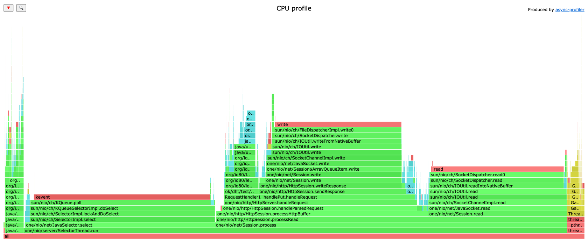
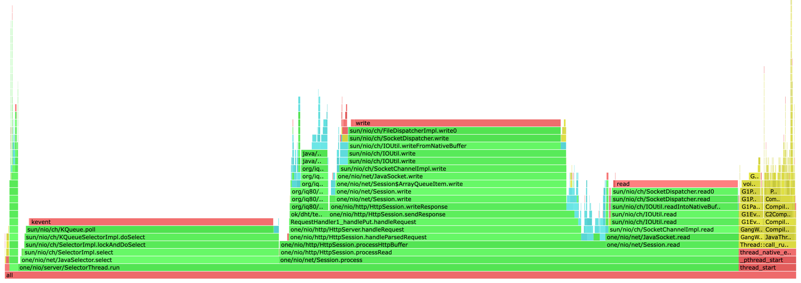
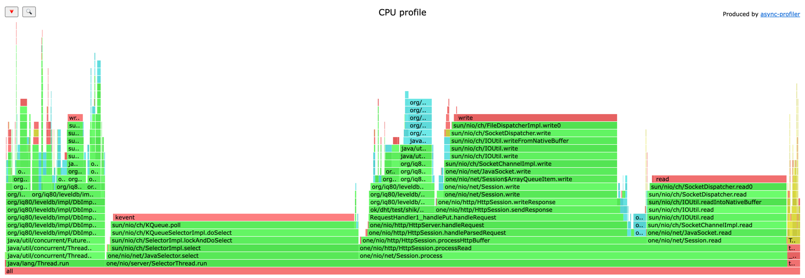
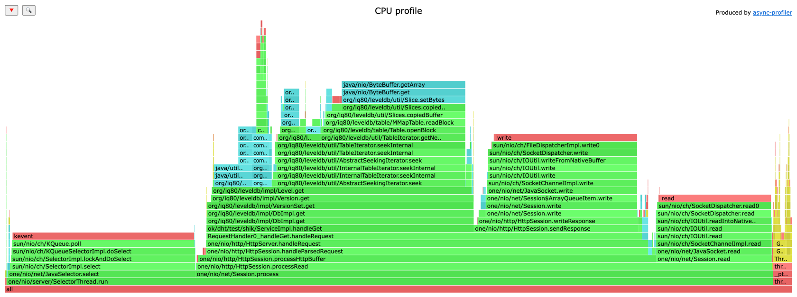
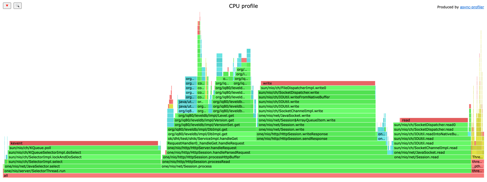
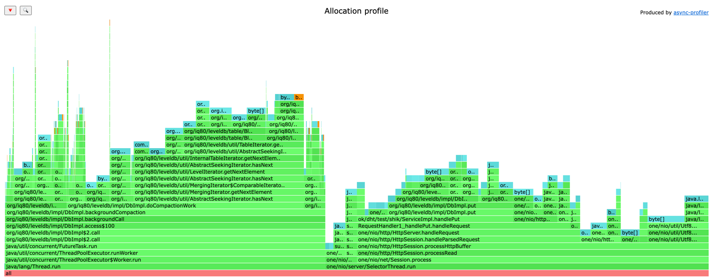

# Отчет по профилированию приложения

## PUT запросы, rate 12000, 2Гб данных в бд

* 32,70% времени занимает `poll()` на селекторе
* 23,84% времени занимает чтение из сокетов
* 23,34% времени занимает запись в сокет, при этом 0,79% тратится на взятие блокировки на запись
* 5,79% времени занимает запись в бд, при этом 3,67% занимает добавление новой записи в memtable, 0,81% - добавление записи в лог
* 3,22% времени занимает compaction, при этом 0,7% занимает запись заполненной memtable в новую sstable, 2,52% - merge sstable одного уровня
* 2,96% времени занимает gc
* 1,45% времени в методе `one.nio.http.Request#getRequiredParameter` - это к минусу спринговых аннотаций
* 0,96% времени `one.nio.http.Response.toBytes`

## PUT запросы, rate 20000, 2Гб данных в бд

Как пример нагрузки, на котором приложение не справляется  
В целом профиль у них примерно одинаковый, только в два раза увеличилось время занимаемое gc, что логично, потому что rate увличился почти в 2 раза, а больше запросов, значит больше аллокаций как от one-nio, так и от compaction в LevelDB, причем аллокации от one-nio явно существуют только во время запроса, поэтому дальше они становятся проблемой для gc.  
Могу сделать вывод, что при put запросах узким местом является не LevelDB, а работа с сетью

## PUT запросы, rate 15000, 7Гб данных в бд

* 30,62% времени занимает `poll()` на селекторе
* 21,75% времени занимает запись в сокет
* 17,60% времени занимает чтение из сокетов
* 12,43% времени занимает compaction, при этом 3,07% занимает запись заполненной memtable в новую sstable, 8,87% - merge sstable одного уровня
* 8,24% времени занимает запись в бд, при этом 4,1% занимает добавление новой записи в memtable, 2,24% - добавление записи в лог
* 1,61% времени занимает gc  

С ростом размера бд заметно выросло время на compaction, что логично, потому что чаще происходит слияние 2-о уровня с 3-м и 3-о с 4-м (в LevelDB на уровне i >= 1 не более 10^i Мб)

## GET запросы, rate 12000, 7Гб данных в бд

* 33,9% времени занимает чтение из бд, основное время тратится на поиск записи в каждом из уровней ss-таблиц, 4,85% тратится на бинпоиск sstable, в которой может находиться ключ, 24% - на поиск ключа внутри одной sstable
* 23,14% времени занимает `poll()` на селекторе
* 19,06% времени занимает запись в сокет
* 14,67% времени занимает чтение из сокетов
* 2,42% времени занимает gc

## GET запросы, rate 12000, 2Гб данных в бд

* 31,03% времени занимает `poll()` на селекторе
* 24,44% времени занимает запись в сокет
* 18,4% времени занимает чтение из бд, основное время тратится на поиск записи в каждом из уровней ss-таблиц, 3,92% тратится на бинпоиск sstable, в которой может находиться ключ, 7,93% - на поиск ключа внутри одной sstable
* 16,14% времени занимает чтение из сокетов
* 2,63% времени занимает gc

С ростом размера бд значительно увеличивается время чтения из бд. Основной рост обеспечивается методом `org.iq80.leveldb.table.Table#openBlock`, в нем считывается с диска sstable, в которой предположительно может лежать запись с данным ключом   
Нетрудно заметить, что операция чтения в LevelDB работает дольше чем операция записи, что может быть очень выгодно для write intensive workload-ов и неприемлемо для read intensive workload-ов  
Ясно, что оптимальность операции записи связана с тем, что запись происходит в memtable, а на диск она флашится только когда заполняется memtable (а на самом деле в LevelDB есть mutable memtable, в которую пишутся данные и immutable memtable, в которую данные не пишутся, но она еще хранится в ram. Это хорошая оптимизация для чтения горячих данных, так как в таком случае операций с диском вообще не будет)  
В моем workload-е идут запросы чтения холодных данных, отчасти поэтому получается невысокий performance

## Alloc, PUT запросы, rate 12000, 7Гб данных в бд

* 45,39% аллокаций при compaction, из них 8,68% при работе с memtable и 33,67% при работе с ss-таблицами
* 17,79% аллокаций при записи в бд
* 5,77% аллокаций на парсинг запроса и еще 2,67% на парсинг тела
* 8,65% аллокаций на чтение данных из сокета
* 4,49% аллокаций на работу селектора

## Alloc, GET запросы, rate 12000, 7Гб данных в бд

* 95,53% аллокаций при чтении из бд, из них:
1) 53,95% аллокаций в методе `org.iq80.leveldb.impl.Level.get`.  
  Там для каждого уровня (их <= 6) аллокируется массив длиною в число файлов (sstable) на данном уровне `List<FileMetaData> fileMetaDataList = new ArrayList<>(files.size())`. В моем случае их (3, 50, 262, 2953) на 1-4 уровнях.  
  Вообще это совсем неоправданные аллокации, потому что обычно данные ключу будут содержаться далеко не во всех sstable. Мне кажется, в этом случае стоит создавать пустой ArrayList, чтобы он расширялся по мере нахождения подходящих файлов, а в идеале собирать статистику по работе приложения - среднее по всем ключам число файлов, в которых они содержатся для каждого уровня, тогда можно будет в рантайме определять оптимальную стратегию. 
4) 23,31% аллокаций - создание итераторов на поиск записи внтури sstable. Там идет цепочка аллокаций итераторов, сначала `org.iq80.leveldb.impl.TableCache.newIterator(long)`, потом `org.iq80.leveldb.table.Table.iterator`, потом `org.iq80.leveldb.table.Block.iterator`, а потом внутри `BlockIterator` идет `seekToFirst`, внутри которого есть `org.iq80.leveldb.table.BlockIterator.readEntry` с чтением записи и, соответственно, аллокацией в размере этой записи плюс объект обертка `BlockEntry`. 
5) 15,32% аллокаций - поиск внутри sstable записи и её считывание
* 1% аллокаций при записи в сокет
* 0,71% аллокаций при парсинге запроса

## Вывод
* Так как при записи данные пишутся в memtable (и иногда flush'атся в sstable), то сама запись происходит быстро и не является узким местом
* Чем больше размер базы, тем больше времени приходится тратить на compaction
* Чем больше размер базы, тем дольше работает чтение, потому что становится больше уровней, на каждом из которых нужно искать sstable, в которой может быть запись, а потом искать саму запись
* На один put запрос LevelDB аллоцирует меньше чем one-nio 
* На один get запрос LevelDB аллоцирует, по моему мнению, много лишнего
* При большой загрузке бд (в моем случае 7Гб) чтение из базы данных становится сравнимым с работой с сетью по времени и значительно превосходит по числу аллокаций
* Даже при большой загрузке бд запись в нее остается очень быстрой