# Домашнее задание 2

## Put запросы 

### Дз1, 12 соединений, 55k rps, put запросы
Сделал новое профилирование с многопоточкой, чтобы проанализировать профит от добавления воркеров, а не от докидывания числа соединений.  
Число 12 взято не случайно, в one-nio по умолчанию используется 12 селектор тредов. Как раз каждый из них будет получать нагрузку.
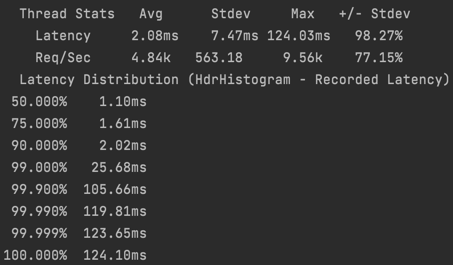
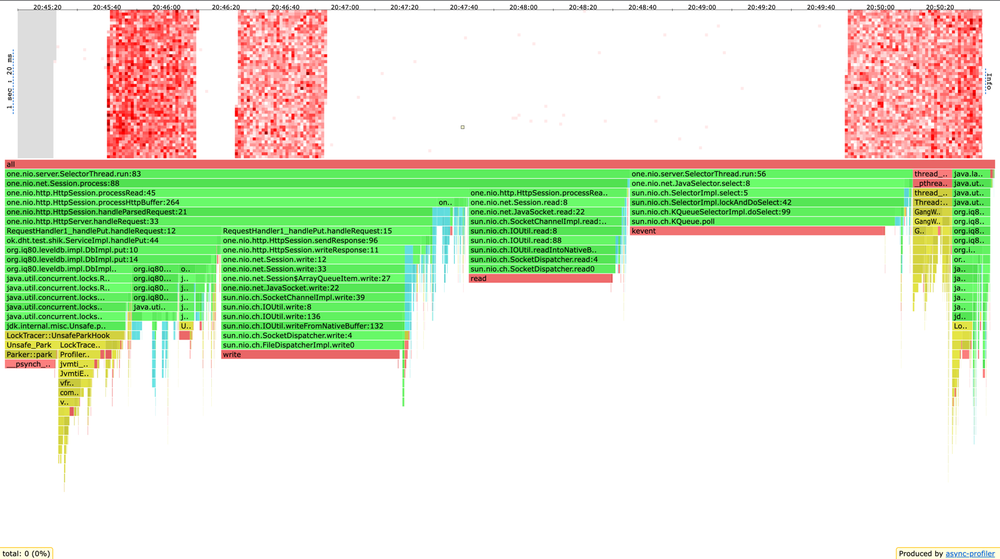
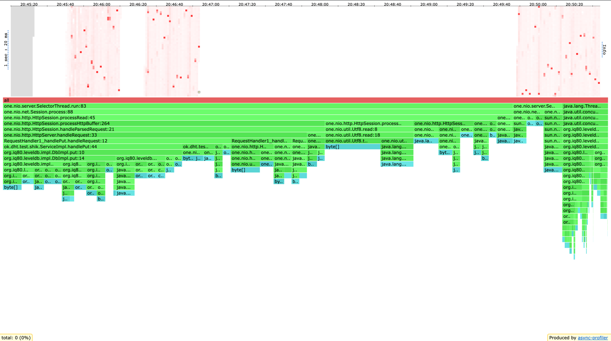

### Дз2, 12 соединений, 55k rps, put запросы
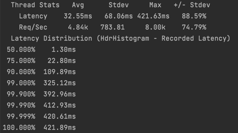
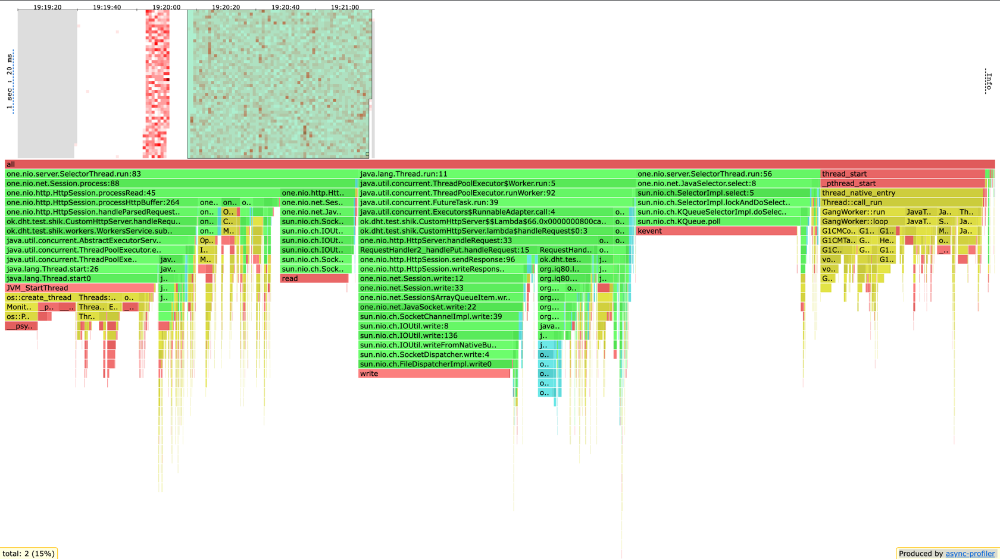
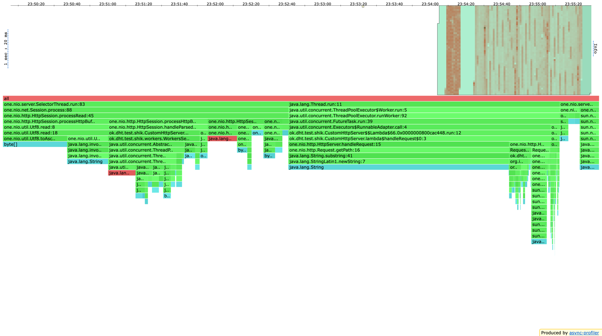

Изменения за счет добавления воркеров:
* Latency в большей части запросов выросла. Это можно обосновать тем, что операция записи в LevelDB очень дешевая и накладные расходы на создание таски и её шедулинг оказались дороже чем просто выполнение таски в том же потоке селекторе
* На 5% меньше времени проводим в методе select, потому что за счет воркеров большая часть работы перешла от selector потока в worker поток.
* На 8% увеличилось время gc. Отчасти это связано с тем, что теперь стало больше аллокаций: 1) runnable, которые сабмитятся в pool; 2) накладные расходы на thread pool и на очередь внутри него в частности. А еще сюда явно перетекла часть 5%, выигранных на select.
* В коде из первого дз сильно больше времени проводится на взятии блокировки перед записью. Не думаю, что это связано с кодом из дз2, скорее всего в этот момент compaction держал блокировку достаточно долгое время, например, после compaction 2 уровня в 3 удалял таблицы 2 уровня, при этом он бы все время держал блокировку и воркерам пришлось бы ждать его перед записью.
* 4,5% тратится на создание потоков в thread pool. Это связано с тем, что в дефолтном конфиге стоит `corePoolSize = 0`, то есть изначально потоков будет 0, а создаваться они будут при появлении запросов (в том случае если остальные потоки заняты работой и суммарное число тредов < maxPoolSize). А еще в дефолтном конфиге стоит `keepAliveTime = 0`, то есть если в какой-то момент к нам перестанут приходить запросы (или rpc станет меньше), то thread pool уменьшит число потоков до corePoolSize (соответственно, если потом rps возрастет, будут снова создаваться потоки). Оба этих параметра можно потюнить.
* 90% запросов обрабатываются за 2ms, что хорошо. Если смотреть на запросы, попавшие в хвост распределения, то вероятнее всего, это запросы, которым: 1) не повезло с взятием блокировки при попадании в очередь пула потоков; 2) в целом потоку, обрабатывавшему этот запрос не повезло с cpu (так как в моем конфиге по умолчанию потоков создается больше чем свободных ядер, какому-то потоку может в целом не везти); 3) эти запросы могут происходить параллельно с compaction и проигрывать ему блокировку (в частности, compaction может достаточно долго держать блокировку, что вполне объясняет запросы за ~100ms). 

### Профиль блокировок

* 70% занимают блокировки во время compaction. В реализации LevelDB при compaction конкретного уровня для каждого ключа (получаемого из merge файлов этого уровня и файлов верхних уровней, пересекающихся с ними по ключам) берется блокировка, чтобы скомпактить immutable memtable. Понятно, что раз эта блокировка берется на каждый ключ, то она не бесплатная, особенно учитывая, что параллельно несколько потоков пытаются писать в mutable memtable под этой же блокировкой. Также блокировка держится при удалении таблиц после compaction.
* 20% занимают блокировки во время добавления тасок в executor. Здесь тоже нет ничего удивительного, потому что в одну очередь добавляют таски несколько потоков одновременно.
* 4% занимают блокировки при записи в базу данных.

Здесь достаточно простора для оптимизаций:
* Можно сделать отдельную блокировку для всех memtable и всех sstable. Тогда compaction будет не так сильно аффектить операции записи. Например, при compaction мы периодически берем блокировку на memtable, что компактить и флашить её, при этом все время держим блокировку на ss-таблицы. Тогда при удалении старых таблиц в конце compaction нам не придется держать блокировку на memtable, что явно улучшит производительность.
* Можно сделать отдельную блокировку для каждого уровня ss-таблиц. Ведь во время compaction 2 уровня мы никак не аффектим 0-й уровень, а значит флашить таблицы на нулевой уровень можно только с блокировкой на 0-й уровень (вспоминаем, что там таблицы с пересекающимися ключами, а не помердженные). Также можно сливать 0-й уровень с 1-м и параллельно сливать 3-й уровень с 4-м. Очевидно, для такого понадобится иерархическая блокировка, но дедлоков в любом случае не будет, потому для compaction i-о уровня нужно держать блокировку только на несколько больших уровней (в LevelDB на i+1-й и i+2-й) (понятно, раз нам нужны только большие номера, то граф зависимостей ациклический и дедлоков не бывает).
* Можно попробовать засунуть в ThreadPool lock-free очередь. И хотя в ней не будет блокировок, performance может уменьшиться, поэтому это спорное улучшение.

## Get запросы

### Дз2, 12 соединений, 40k rps, get запросы
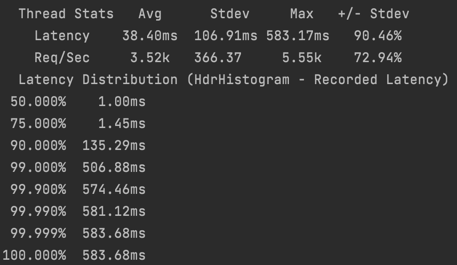
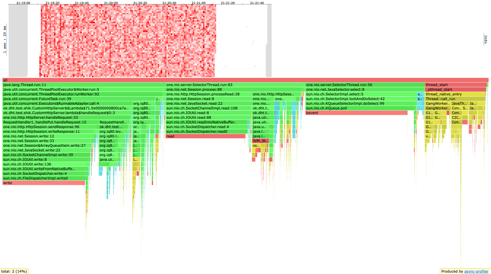
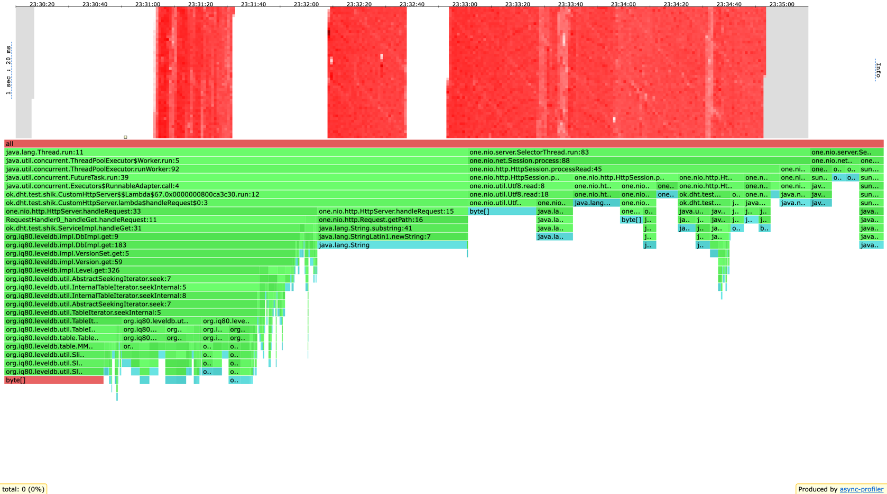

### Дз 1, 12 соединений, 50k rps, get запросы
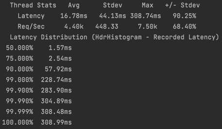
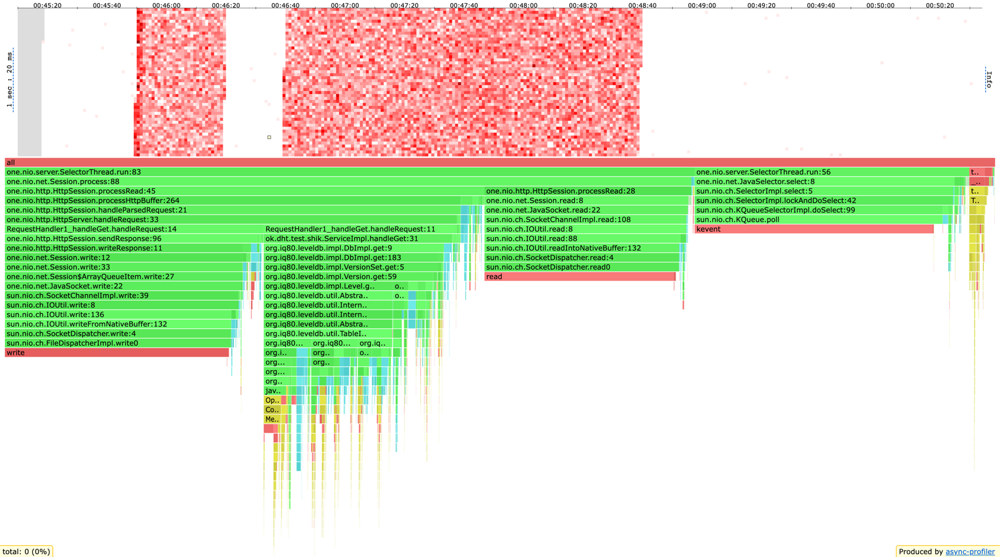
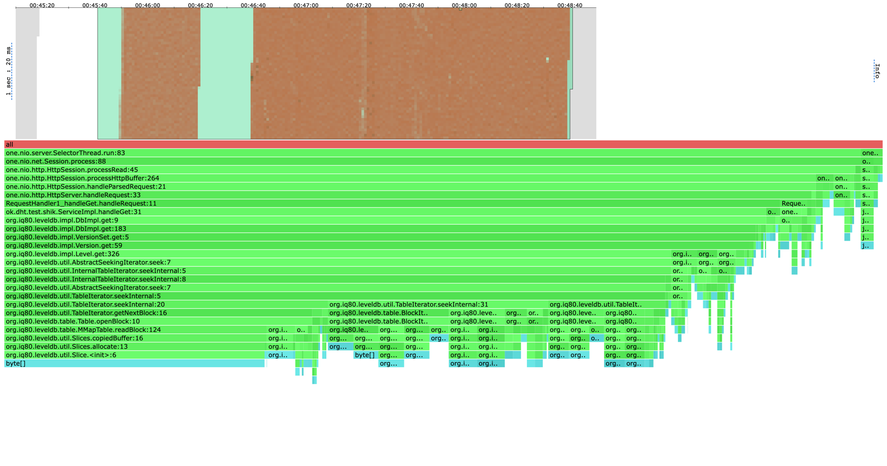

Изменения за счет добавления воркеров:
* Предельный rps уменьшился c 50k до 40k
* На 4% уменьшилось время чтения записи
* На 4% уменьшилось время select
* На 1% уменьшилось время чтения из сокета
* На 4% уменьшилось время записи в сокет
* Появились 2% на старт рабочих потоков в thread pool
* Увеличилось время работы gc. Отчасти это связано с тем, что теперь стало больше аллокаций: 1) runnable, которые сабмитятся в pool; 2) накладные расходы на thread pool и на очередь внутри него в частности  

Пример с rps 50k для get из дз2
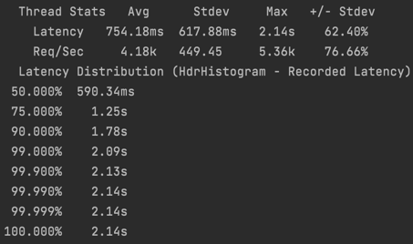  
Думаю, что такое замедление связано с тем, что операция чтения выполняется достаточно быстро и накладные расходы на рабочие потоки не окупаются. А это происходит, потому что я не так сильно как в дз1 заполнил бд (сейчас тестировал при 1Гб, тогда до 7Гб добил).  

Само распределение процессорного времени стало лучше, потому что из selector потока вынесена обработка самого запроса чтения и записи в сокет, а значит, если вместо операции чтения будет что-то более тяжелое (например, поход по сети в 3 других сервиса и какая-то логика на основании их ответов), то эта нагрузка ляжет только на воркеров и все накладные расходы окупятся.

### Профиль блокировок

Общая картина как в профиле put. Из особенностей:
* Всего лишь 0,16% приходится на обработку get запроса базой данных. Это связано с тем, что блокировка держится только на момент обращения к memtable, что очень быстро, а затем отпускается, поэтому она незначительно влияет на программу.

### Профиль аллокаций
В целом и в put, и в get запросах картина не поменялась, хотя ясно, что аллокаций стало немного больше за счет создания тасок и накладыных расходов на сам thread pool и его очередь для тасок в частности

## Сравнение с однопоточным решением
Код из дз1 перетестировал на текущей базе в 1Гб
* В дз1 с одним соединением операция put стабильно работает c rps 17k, в дз2 при 12 соединениях работает с трудом при 55k rps и легко при 50k rps. Таким образом, увеличили rps в 3 раза.
* В дз1 с одним соединением операция get стабильно работает c rps 16k, в дз2 при 12 соединениях работает при 40k rps. Таким образом, увеличили rps в 2.5 раза.